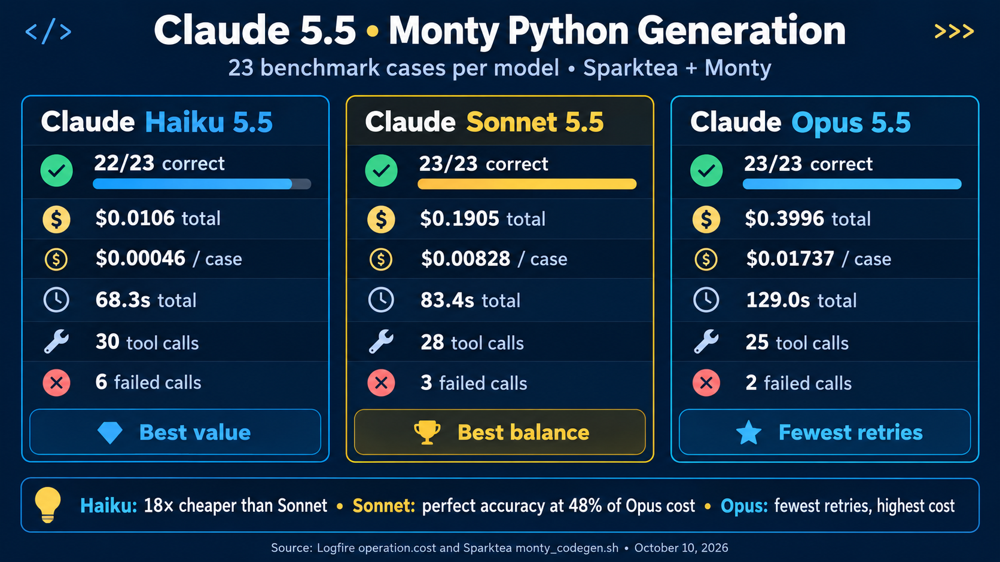
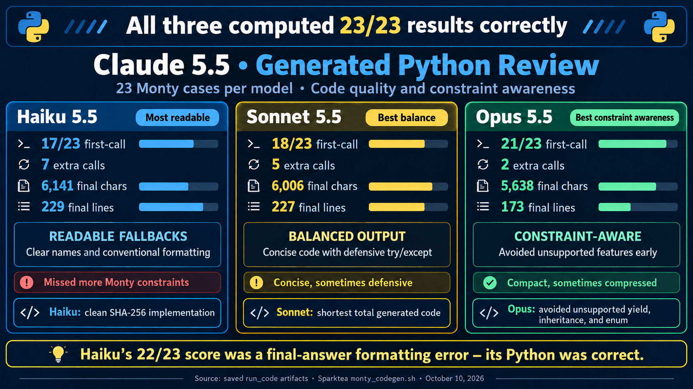

# Claude 5.5 code generation on Monty

This report compares Claude Haiku 5.5, Sonnet 5.5, and Opus 5.5 using
sparktea's `monty_codegen.sh` benchmark on October 10, 2026. It focuses on
the Python each model submitted to `run_code`, not only whether the final
answer matched the benchmark.





## Executive summary

All three models eventually computed the correct value in all 23 cases.
Haiku's reported 22/23 score came from writing `1234567` in its final
`ANSWER:` line after `run_code` had correctly returned `1,234,567`.

- **Haiku 5.5** was by far the least expensive and usually produced the
  most conventionally readable Python. It also overlooked the most Monty
  restrictions, requiring seven extra tool calls.
- **Sonnet 5.5** was the best overall balance. It produced the least code
  across all attempts, gave a correct final answer in every case, and cost
  less than half as much as Opus.
- **Opus 5.5** adapted to Monty's restrictions most consistently. It
  completed 21 of 23 cases with one tool call and produced the smallest
  final code set, but was slower and cost about 2.1 times as much as
  Sonnet.

The benchmark is a single run per model, not a statistically significant
evaluation. Its strongest evidence is the qualitative difference in how
the models reacted to the same explicit tool documentation.

## Method

`monty_codegen.sh` sends 23 independent prompts through sparktea with Code
Mode enabled. Every prompt requires `run_code` and an `ANSWER: <value>`
line. The cases deliberately request features that Monty either does not
support or only partially supports, including:

- class inheritance and custom exception classes;
- generator functions and `match` statements;
- `property`, `enum`, `statistics`, and `hashlib`;
- `re.VERBOSE`, Latin-1, and selected dataclass helpers;
- deep recursion beyond sparktea's configured depth limit.

The `run_code` description tells the model about these limitations and
suggests plain-Python substitutes. A first-attempt failure therefore
measures how well the model uses tool instructions, not merely whether it
knows normal Python.

Each case was run once, with four cases in parallel. The saved artifacts
contain the model's final response, every `run_code` argument and result,
and any tool error. Logfire supplied request timing, tokens, cache usage,
and `operation.cost`.

### Metric definitions

- **Scored result:** whether the final `ANSWER:` line contained the expected
  value after whitespace normalization.
- **Correct computation:** whether the successful Python result contained
  the correct value, even if the final prose copied it incorrectly.
- **First-call completion:** a case that used exactly one `run_code` call.
- **Extra calls:** total calls beyond the minimum of one per case.
- **Tool error:** a failure returned by `run_code`. An exception caught by
  the generated Python is not counted as a tool error.
- **Final code:** the last `run_code` submission for each case.

## Quantitative results

| Metric | Haiku 5.5 | Sonnet 5.5 | Opus 5.5 |
| --- | ---: | ---: | ---: |
| Scored results | 22/23 | 23/23 | 23/23 |
| Correct computations | 23/23 | 23/23 | 23/23 |
| First-call completions | 17/23 | 18/23 | 21/23 |
| Cases needing another call | 6 | 5 | 2 |
| Total `run_code` calls | 30 | 28 | 25 |
| Extra calls | 7 | 5 | 2 |
| Tool-reported errors | 6 | 3 | 2 |
| Code across all calls | 8,053 chars | 7,207 chars | 7,435 chars |
| Final code | 6,141 chars | 6,006 chars | 5,638 chars |
| Final code lines | 229 | 227 | 173 |
| Average final code per case | 267 chars | 261 chars | 245 chars |

Opus's advantage is clearest in first-call completion and final-code size.
Sonnet generated the fewest total characters because its retries tended to
be shorter than Opus's two large attempts. Haiku generated the most code
because it retried more often.

### Logfire usage and cost

| Metric | Haiku 5.5 | Sonnet 5.5 | Opus 5.5 |
| --- | ---: | ---: | ---: |
| Benchmark cost | $0.010610 | $0.190456 | $0.399590 |
| Average cost per case | $0.000461 | $0.008281 | $0.017374 |
| Total benchmark time | 68.3 s | 83.4 s | 129.0 s |
| Average time per case | 2.97 s | 3.63 s | 5.61 s |
| Average time to first content | 0.73 s | 1.13 s | 1.98 s |
| Model requests | 53 | 51 | 48 |
| Input tokens | 86,145 | 80,284 | 76,467 |
| Output tokens | 10,068 | 8,412 | 9,728 |
| Cache-write tokens | 40,881 | 39,136 | 39,416 |
| Cache-read tokens | 45,112 | 41,000 | 36,909 |

Haiku was about 18 times cheaper than Sonnet and 38 times cheaper than
Opus for this run. Opus made fewer model requests but its higher token
price dominated the savings from fewer retries.

## Compatibility behavior by case

| Case | Haiku 5.5 | Sonnet 5.5 | Opus 5.5 |
| --- | --- | --- | --- |
| `statistics` | Manual arithmetic, first call | Manual arithmetic, first call | Manual arithmetic, first call |
| `inheritance` | Tried inheritance, then separate classes | Tried inheritance, then separate classes | Used separate classes immediately |
| `property` | Tried `property`, then `__getattr__`, then a method | Used a getter method immediately | Tried `property`, then a method |
| `generator` | Tried `yield`, then an iterator class | Tried `yield`, then an iterator class | Used a direct Fibonacci loop immediately |
| `match` | Used `if`/`elif` immediately | Used `if`/`elif` immediately | Used `if`/`elif` immediately |
| `custom_exc` | Tried a custom exception, then `ValueError` | Used `ValueError` immediately | Used `ValueError` immediately |
| `enum` | Emulated values with a plain class | Tried `Enum`, then used a dictionary | Emulated values with a plain class and dictionary |
| `dataclass` | Used `dataclass`, but manually built dictionaries | Tried requested helpers with an in-call fallback | Tried requested helpers with an in-call fallback |
| `regex` | Tried missing `re.VERBOSE`, then inline `(?x)` | Caught a bad first pattern, then retried | Caught the missing flag and emulated it in one call |
| `sha256` | Manual implementation, first call | Manual but overengineered implementation, first call | Manual implementation; retried after a bytes conversion error |
| `lru_cache` | Used dictionary memoization immediately | Probed the import, then used a dictionary in one call | Used dictionary memoization immediately |
| `latin1` | Caught codec failure, then used `ord` | Caught codec failure, then used `ord` | Returned an `ord` fallback from the first call |
| `deep_recursion` | Divide-and-conquer recursion | Divide-and-conquer recursion | Divide-and-conquer recursion |
| `formatting` | Python correct; final answer lost commas | Python and final answer correct | Python and final answer correct |

The remaining straightforward cases—arithmetic, primes, `Counter`, JSON,
dates, asyncio, itertools, sorting, and naive Fibonacci—were correct on the
first call for all three models.

## Review of the generated code

### Ordinary Python was not differentiating

For simple calculations the models converged on nearly identical code. The
sum-of-squares case is representative:

```python
sum(i*i for i in range(1, 101))
```

The datetime and itertools cases were similarly direct. Differences in
these cases were mostly stylistic: Haiku tended to use spaces and
descriptive names, while Sonnet and Opus compressed expressions more
aggressively.

### All three handled bounded recursion well

The prompt prohibited loops and `sum()` while asking for the sum from 1 to
500. Linear recursion would exceed sparktea's depth limit. All three models
used a balanced recursive split, reducing the depth to roughly logarithmic:

```python
def add_range(lo, hi):
    if lo == hi:
        return lo
    mid = (lo + hi) // 2
    return add_range(lo, mid) + add_range(mid + 1, hi)

add_range(1, 500)
```

This was the clearest shared example of adapting the algorithm rather than
merely translating the prompt literally.

### Opus avoided unsupported syntax most consistently

The generator prompt explicitly asked for a generator function, but the
tool description said that `yield` was unsupported. Opus went directly to
the computation that mattered:

```python
a, b = 1, 1
for _ in range(28):
    a, b = b, a + b
b
```

Haiku and Sonnet first submitted generator functions, received a parser
error, and then implemented iterator classes. Their recovery code was
valid, but substantially larger than the direct loop.

Opus behaved similarly on inheritance and enum: it preserved the requested
data and behavior without first submitting syntax that Monty had already
been documented as rejecting.

### Sonnet made the best property substitution

Sonnet immediately replaced the unavailable property mechanism with a
normal method:

```python
class Temperature:
    def __init__(self, celsius):
        self.celsius = celsius

    def get_fahrenheit(self):
        return self.celsius * 9 / 5 + 32

Temperature(100).get_fahrenheit()
```

Opus first tried constructing `property` directly and needed a second call.
Haiku tried `property`, then `__getattr__`, and finally a normal method. This
case shows that a larger model did not uniformly dominate: Sonnet chose the
cleanest compatible representation immediately.

### SHA-256 exposed meaningful quality differences

Because `hashlib` is unavailable, the models had to implement SHA-256.

Haiku produced the cleanest version: it used the standard fixed constants,
a named rotation helper, explicit message padding, and ordinary loops. It
was long because the algorithm is long, but the structure was readable and
it succeeded on the first call.

Sonnet also succeeded immediately, but its implementation contained dead
and distracting logic:

```python
K = []
n = 2
while len(K) < 64:
    if all(n % p for p in range(2, int(n**0.5) + 1)):
        K.append(int((n**(1/3) % 1) * 2**32) if False else 0)
    n += 1
```

It then discarded that list and recomputed the constants using custom
integer square-root and cube-root routines. The result was correct, but the
dead `if False` branch and enormous binary-search bounds made this the
weakest maintainability example in the run.

Opus used fixed constants and concise code, but its first attempt relied on
a bytes conversion Monty rejected. The corrected version replaced that
conversion with explicit character and integer operations. Its final code
was effective but more densely packed than Haiku's.

### In-code fallbacks hide some failed strategies

Tool-error totals do not capture every unsuccessful approach. Sonnet's
first regex call caught its own invalid-pattern exception and returned the
error string, so `run_code` itself succeeded. The model then made another
call with the corrected pattern. Its Latin-1 case followed the same shape.

Opus more often placed the fallback in the same script. For example, it
attempted Latin-1 encoding and returned `ord(s[-1])` from the exception
path. This kept the case to one tool call, although the preferred operation
still failed internally.

For this reason, **extra calls** and **first-call completion** are better
comparative measures than tool errors alone.

### Haiku's only scored failure was outside the code

Haiku submitted:

```python
f"{1234567:,}"
```

Monty returned `1,234,567`. Haiku's prose repeated that value correctly,
but its machine-readable final line was:

```text
ANSWER: 1234567
```

This is a response-formatting failure, not a Python-generation failure. A
consumer that relies on the final answer rather than the tool result still
experiences it as a real failure, so both measurements are useful.

## Model-by-model assessment

### Haiku 5.5

Strengths:

- lowest cost and fastest completion by a wide margin;
- readable names and conventional formatting;
- strong manual SHA-256 implementation;
- correct computation in every case;
- good algorithm choice for deep recursion and memoization.

Weaknesses:

- ignored more explicitly documented Monty restrictions;
- needed the most retries and generated the most code overall;
- sometimes preserved prompt wording too literally before adapting;
- made the run's only final-answer transcription error.

Haiku is attractive for high-volume, easily validated computation. It
benefits most from automatic checking of final formatting and from concise,
prominent runtime restrictions.

### Sonnet 5.5

Strengths:

- correct final answer in every case;
- lowest total generated-code volume across all attempts;
- generally concise without Opus's degree of compression;
- best immediate solution to the property case;
- much less expensive than Opus.

Weaknesses:

- still tried three syntax features documented as unsupported;
- used defensive `try`/`except` blocks where direct compatible code would
  have been simpler;
- produced the most overengineered individual solution in the SHA-256 case.

Sonnet is the strongest default for interactive Code Mode when correctness,
latency, readability, and cost all matter.

### Opus 5.5

Strengths:

- best first-call completion rate;
- fewest extra calls and smallest final code set;
- strongest use of Monty's documented restrictions;
- correct final answer in every case;
- good at reducing an impossible literal request to its computational goal.

Weaknesses:

- about 2.1 times Sonnet's cost and roughly 55% slower in this run;
- compressed formatting reduced readability in several solutions;
- still missed the property limitation and a bytes-conversion issue;
- fewer retries did not translate into lower overall cost.

Opus is most useful when avoiding tool-loop retries or interpreting unusual
constraints is more valuable than latency and token cost.

## Benchmark limitations

1. **One sample per case.** Model output is stochastic. Repeated runs are
   needed for confidence intervals or stable rankings.
2. **Answer-oriented scoring.** The harness checks the final value, not
   whether the code literally used the feature requested by the prompt.
   This is intentional for unsupported features, but it limits claims about
   instruction fidelity.
3. **Substring matching.** A final answer passes when it contains the
   expected string after whitespace removal. This is practical but not a
   general semantic evaluator.
4. **Caught exceptions are invisible to tool-error counts.** Generated code
   can probe an unsupported operation, catch the failure, and still produce
   a successful tool result.
5. **Code size is not code quality.** Character and line counts describe
   verbosity and retry cost, not maintainability by themselves.
6. **Caching was active.** Cache reads and writes affected billed input
   costs. The models had similar but not identical cache-token distributions.
7. **Parallel execution affects wall time.** The four-worker benchmark is
   representative of batch throughput, not isolated single-request latency.
8. **The suite is Monty-specific.** Results should not be generalized to
   unrestricted CPython generation or broader software-engineering tasks.

## Recommended harness improvements

- Report **computation correctness** and **final-answer correctness** as
  separate fields.
- Add **cases requiring retries** and **extra calls** to the summary rather
  than relying on tool errors.
- Detect caught error strings in successful tool results where practical.
- Save a normalized code-only artifact for each attempt to make future
  diffs easier.
- Add a small rubric for constraint compliance, clarity, and unnecessary
  complexity alongside answer correctness.
- Run each model multiple times with controlled concurrency and report
  distributions for accuracy, cost, latency, and retries.
- Add an output-format validator or structured result so a correct tool
  result is less likely to be corrupted in the final response.

## Practical conclusion

For this workload, Sonnet 5.5 is the most defensible default. Haiku 5.5 is
the clear throughput and cost choice when results can be checked
automatically. Opus 5.5 provides the strongest constraint handling, but its
two-call advantage over Sonnet did not justify the 2.1-times cost for these
small programs.

The larger lesson is that final benchmark accuracy alone obscures useful
differences. Haiku's only scored miss was not a code error, Sonnet's perfect
score included avoidable retries and one poor implementation, and Opus's
cleanest tool-loop behavior came with substantially higher cost and latency.
